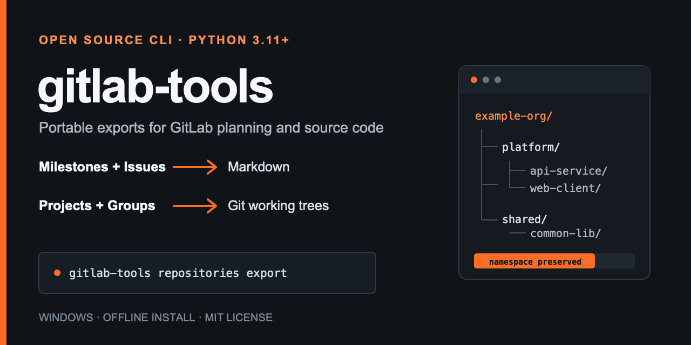

# gitlab-tools

[](https://github.com/sgh6688/gitlab-tools/actions/workflows/ci.yml)
[](https://github.com/sgh6688/gitlab-tools/releases/latest)
[](https://www.python.org/)
[](LICENSE)

English | [简体中文](README.zh-CN.md)



Export GitLab milestones and issues to Markdown, or clone projects and groups as ordinary Git working trees. The CLI works well on Windows, supports fully offline installation, and has no third-party Python runtime dependencies.

## What it does

| Command | Result |
|---|---|
| `gitlab-tools milestones export` | Markdown files for group/project milestones and their issues |
| `gitlab-tools repositories export` | Normal Git working trees for projects or every project in a group |

Repository export preserves each project's full GitLab namespace. Group export includes subgroups by default. HTTP and SSH clone are supported.

This is not a full GitLab instance backup. It does not export the GitLab database, CI/CD variables, container registry, package registry, runners, permissions, or instance settings.

## Quick start

Requirements:

- Python 3.11 or newer
- Git, when using repository export
- Network access to the target GitLab instance

Install the current Wheel directly from GitHub Releases:

```console
python -m pip install "https://github.com/sgh6688/gitlab-tools/releases/download/v0.3.3/gitlab_tools-0.3.3-py3-none-any.whl"
```

Create editable configuration files and Windows launchers:

```console
python -m gitlab_tools milestones init-config
python -m gitlab_tools repositories init-config
```

Set a GitLab token without writing it to a configuration file:

```console
# Windows CMD
set GITLAB_TOKEN=your-token

# PowerShell
$env:GITLAB_TOKEN = "your-token"

# macOS or Linux
export GITLAB_TOKEN=your-token
```

Run an export:

```console
python -m gitlab_tools milestones export
python -m gitlab_tools repositories export
```

For air-gapped installation, download the Wheel on a connected machine, transfer it through an approved channel, then run:

```console
python -m pip install --no-index ./gitlab_tools-0.3.3-py3-none-any.whl
```

The machine does not need internet access, but it still needs access to the target GitLab server when an export runs.

## Examples

The [`examples/`](examples/) directory contains synthetic output with no real organization, user, project, or server data:

- [Milestone Markdown](examples/milestone-example.md)
- [Issue Markdown](examples/issue-example.md)
- [Repository output tree](examples/repository-tree.txt)

A repository export keeps normal working trees rather than creating archives:

```text
Repositories/
└── example-org/
    └── platform/
        ├── api-service/
        │   ├── .git/
        │   └── ...
        └── web-client/
            ├── .git/
            └── ...
```

## Configuration overview

Milestone initialization creates:

```text
milestones.config.txt
run_milestones_export.bat
```

Repository initialization creates:

```text
gitlab.config.txt
repositories.config.txt
run_repositories_export.bat
```

Initialization uses exclusive file creation and never overwrites an existing file. See the [Chinese user guide](USER_GUIDE.md) for every supported setting and copy-ready Windows commands.

## Safety properties

- Tokens can come from environment variables and do not need to be stored in files.
- One token is reused safely for the GitLab API and Git HTTP clone. Cleartext-only internal GitLab servers remain supported with `gitlab_url=http://...`; `git_http_username` can be set when a legacy server or proxy requires the account name instead of the default `oauth2` username.
- HTTP Git authentication is scoped to the validated GitLab origin and is not embedded in clone URLs or remotes.
- Cross-origin API redirects are rejected; Git redirects do not receive the authentication header.
- Repository output rejects traversal, link/junction aliases, Windows reserved names, and normalized path collisions.
- Clone output is staged before installation; existing directories follow an explicit `skip`, `update`, or `fail` policy.
- Logs and errors redact credential values.

See [DESIGN.md](DESIGN.md) for the detailed design and trust boundaries.

## Documentation

- [Chinese user guide](USER_GUIDE.md): installation, configuration, both exporters, offline use, and troubleshooting
- [简体中文 README](README.zh-CN.md): detailed Chinese project overview
- [Release guide](RELEASE.md): build, verify, publish, and distribute the Wheel
- [Contributing](CONTRIBUTING.md): development and pull request workflow
- [Support](SUPPORT.md): usage questions, public bug reports, and data-sanitization rules
- [Security policy](SECURITY.md): supported versions and private vulnerability reporting

## Roadmap

Completed:

- [x] Group/project milestone and issue export to Markdown
- [x] Project/group repository export with subgroup support
- [x] HTTP and SSH clone
- [x] Windows launchers and fully offline Wheel installation
- [x] Path, redirect, authentication, and credential-redaction hardening

Potential next steps are tracked through GitHub Issues rather than promised release dates:

- [ ] Merge Request export
- [ ] Wiki export
- [ ] GitLab release metadata and asset export
- [ ] Incremental backup manifests

Ideas and pull requests are welcome. Open a [feature request](https://github.com/sgh6688/gitlab-tools/issues/new?template=feature_request.yml) before starting a large change.

## Development

```console
python -m compileall -q gitlab_tools tests
python -m unittest discover -s tests -v
python -m pip wheel --no-deps --wheel-dir dist .
```

The CI workflow runs the test suite on Windows, macOS, and Linux with Python 3.11, 3.12, and 3.13. It also builds and installs the Wheel in an isolated environment.

## License

[MIT](LICENSE)

`gitlab-tools` is an independent project. It is not affiliated with or endorsed by GitLab Inc.
